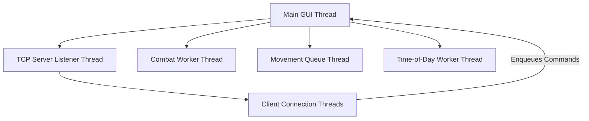

# Kisnard Emulated Server

A self-contained, multi-threaded Python TCP server designed to emulate the backend of the Java-based MMORPG **Kisnard Online**. It includes a graphical administration dashboard, player database persistence, custom event loops, and an integrated Java Binary Object Serialization deserializer.

> [!IMPORTANT]
> **Disclaimer**: This emulated server is a fan-made project created for entertainment purposes only.

---

## 🔗 Client Integration (How it Works)

To make the original Java client communicate with this local emulated server, two key redirection mechanisms are used:

### 1. DNS/Hosts Redirection
The Java client is configured to connect to `localhost` for development. 
* To play on the unofficial emulated server (`www.ThePlayerCity.com`), the **KisnardOnline_Launcher.bat** resolves that domain and maps `localhost` to its IP inside the Windows Hosts file (`%SystemRoot%\System32\drivers\etc\hosts`).
* When running this emulated server locally, we keep the connection routed to `127.0.0.1` (localhost) so the client connects directly to our local Python TCP listener.

### 2. SSL/TLS Truststore Checksum Patching
The original client enforces secure SSL connections and cross-checks its truststore against an online hash list to ensure certificates haven't been tampered with.
* **`patch_checksums.py`** calculates the SHA-1 hash of our emulated server's custom truststore certificates.
* It injects this hash into the client's `checksums.txt` file, bypassing Java's strict certificate verification and allowing the client to accept our emulated SSL handshake without throwing connection errors.

---

## 📂 Directory Structure

```text
KisnardEmulatedServer/
│
├── kisnard_server.py         # Main server code (TCP socket listener, GUI Panel, & game logic)
├── run_local_server.bat      # Startup script that patches SSL truststore and launches server
├── compile_to_exe.bat        # Compiles the server into a standalone Windows binary
│
├── dist/                     # Target directory for the compiled server executable
│   └── kisnard_server.exe    # Compiled standalone server executable
│
├── java_serialization/       # Mimics Java native binary object serialization in Python
│   └── java_serialization.py # Handles stats/inventory packets sent by the Java client
│
├── scratch/                  # Critical runtime databases, scripts, and security certificates
│   ├── database.json         # JSON database (Accounts, Characters, Signs & Books)
│   ├── patch_checksums.py    # Auto-patches client's checksums.txt to accept local SSL
│   ├── server.key            # Private SSL Key for TLS handshake
│   └── server.crt            # Public SSL Certificate
│
├── How to connect/           # Client integration guides
│   ├── README.md             # Guide to starting the server and connecting the client
│   └── KisnardOnline_Launcher.bat.example # Backup of the client launcher batch file
│
└── Log/                      # Automatically generated at runtime
    └── server.log            # Running log of server/client packets and socket events
```

---

## 🌐 Network Protocol & Communication

The server communicates with the Java client over a secure TLS/SSL wrapped TCP connection.
* **Encryption**: Sockets are wrapped in TLS using custom generated PEM certificates (`server.key` and `server.crt`).
* **Packet Structure**: Custom string-based payloads delimited by `@` and `|`:
  * **Incoming (Client to Server)**: `{character_name}-{action}@{arg1}|{arg2}`
  * **Outgoing (Server to Client)**: `{character_name}-{action}@{response_data}`
* **Data Serialization**: Inventory items, banks, character statistics, and active equipment are processed using a custom Python implementation of Java Object Serialization stream headers to exchange binary data structures natively.

---

## 🧵 Threading Architecture

To keep the GUI responsive and prevent network bottlenecks, the server uses a multi-threaded execution model:



### 1. Main / GUI Thread (Tkinter Event Loop)
* Runs the Tkinter user interface.
* Periodically polls queues (`self.poll_queues`) every 100ms to process incoming client commands and update GUI elements thread-safely.
* Triggers a debounced database save (`tick_db_save`) every 5 seconds if a dirty flag is set.

### 2. TCP Server Listener Thread (`start_tcp_server`)
* Runs in a daemon thread.
* Binds the secure socket to `0.0.0.0:34215`, listens, and blocks on `.accept()`.
* Spawns a dedicated thread for each client socket that connects.

### 3. Client Connection Threads (`handle_client`)
* Spawned dynamically for each active connection.
* Blocks on socket reads (`recv`), decodes incoming packet strings, handles low-level keep-alives (pings), and pushes command payloads into the main thread's queue to prevent socket blocking.

### 4. Combat Worker Thread (`combat_worker`)
* Runs in a daemon thread, ticking every 2.0 seconds.
* Iterates through characters currently marked in combat (`self.active_combat`).
* Calculates player vs monster damage formulas, triggers experience rewards, registers bestiary kills, processes level-ups, broadcasts floating hit numbers (`dealtHit`/`receivedHit`), grunts, swings, and death audio effects (`onScreenNoise`).

### 5. Movement Worker Thread (`movement_worker`)
* Runs in a daemon thread.
* Processes coordinate updates (`self.movement_queue`) sequentially.
* Ensures character steps are synchronized smoothly, respects movement cooldowns, and updates player coordinates in the shared memory space.

### 6. Time of Day Worker Thread (`tod_worker`)
* Ticks every 45 seconds to automatically advance the server's time of day index (`0` to `7`).
* Thread-safely updates the GUI Combobox selection and broadcasts the time update packets (`updateTimeOfDay`) to all active clients.

---

## 🕹️ Game Mechanics & Emulation Scope

The server emulates the following mechanics:
* **Account Registry**: Auto-registers new accounts and hashes passwords.
* **Character Customization**: Creation, deletion, and selective loading of player characters (genders, races).
* **Movement & Collision**: Validates movement steps against map collision layers.
* **Combat & Levelling**: Real-time battle updates, level-up calculations, and bestiary records.
* **NPC Shops**: Custom buy/sell transaction processing. Broadcasts client-native purchase (`shopBuyWindowPurchase`) and sale (`shopSellWindowSale`) confirmation packets to display official success notifications and keep UI states synchronized.
* **Character & Account-Wide Banking**: Manages individual character banks and account-wide shared banks (`accountBankWindow`) for transferring items across same-account characters. Double-clicking the Banker NPC in the world directly loads the banking interfaces.
* **Mailbox System**: Full implementation of the in-game mail system. Players can send letters to other characters, view their inbox and sent tabs with proper timestamps, open mail details, and claim item attachments from packages. The server tracks mail status states (`ul` = unread letter, `ol` = opened letter, `up` = unopened package, `op` = opened package, `ep` = empty package) and notifies players of unread mail on login. Online recipients receive real-time `mailboxMessageInfo` notifications when new mail arrives.
* **Signs & Books Interactions**: Detects when coordinates are double-clicked and opens the client reading interface.
* **Equipment & Inventory**: Custom binary serialization of equipment slots and inventory bags.
* **Costume Hiding**: Saves costume preferences to the database and hides/shows character costume sprites accordingly.
* **Chat System**: Supports general, global, whisper, and guild chat functionalities.
* **Social Features**: Friends list management (`addFriend`, `removeFriend`, `friendsWindow`), and Guild creation/management (`guildWindow`, `guildCreate`).
* **Item Management**: Using backpack items (`useBackpackItem`) and moving/picking up items from the ground (`groundMoveOrPickupItem`).
---

## 🛠️ Admin GUI Dashboard Capabilities

The server control panel provides administrators with full monitoring and control capabilities:

### 🎛️ Top Control Panel
* **Verbose Log Toggle**: Toggles full network packet tracing in the console.
* **Time of Day Combobox**: Manually change the server time (`Dawn`, `Day 1-4`, `Dusk`, `Night 1-2`) to immediately broadcast lighting updates.

### 🗂️ Left Notebook Panel
* **Players Tab**:
  * Displays a listbox of all online players.
  * Clicking a player opens a detailed inspection window showing their **Stats** (HP, Mana, Level, Coordinates, Gold), **Inventory** items, and **Equipped** gear.
  * Administrative commands: **Kick Player** (closes socket) and **Ban Account** (updates database record).
* **Guilds Tab**: Lists all registered guilds and permits renaming/editing.
* **Interactables Tab**:
  * Shows all coordinate-to-ReadID mappings for signs, gravestones, and books.
  * **Double-click to Edit**: Double-clicking any coordinate mapping in the listbox automatically populates the input fields and focuses the cursor, allowing quick adjustments.
  * **Add/Update & Remove**: Add new coordinate read triggers or delete existing ones.

### 📜 Right Console Notebook
* **Console Logs**: Renders socket status, packet data, database actions, and connection milestones.
* **Chat Logs**: Real-time capture of player chat.
